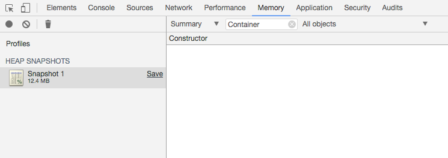
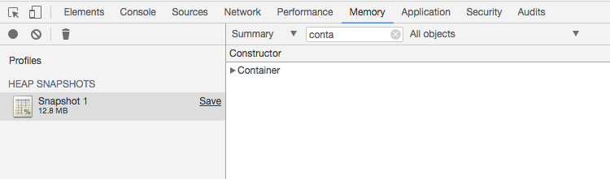
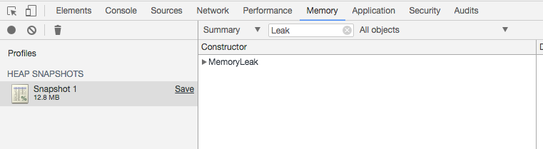

# e-cp-v-memleak

Reproduction of a memory leak issue in `ember-cp-validations: https://github.com/offirgolan/ember-cp-validations/issues/485

## Not leaking

The simple `no-leak` component does not use a validation mixin. And visiting a page with this component and going 
somehwere else does not cause a memory leak. Steps to reproduce:

* Run the 'no leak' acceptance test
* Create a heap snapshot in Chrome

There is no `Container` instance left:

## Memory leak

The  `memory-leak` component *does* use a validation mixin. And visiting a page with this component and going 
somehwere else causes a memory leak. Steps to reproduce:

* Run the 'leak' acceptance test
* Create a heap snapshot in Chrome

There is a `Container` instance left:

Also you can see the component instance (ES6 class `MemoryLeak`) not being GCed:

